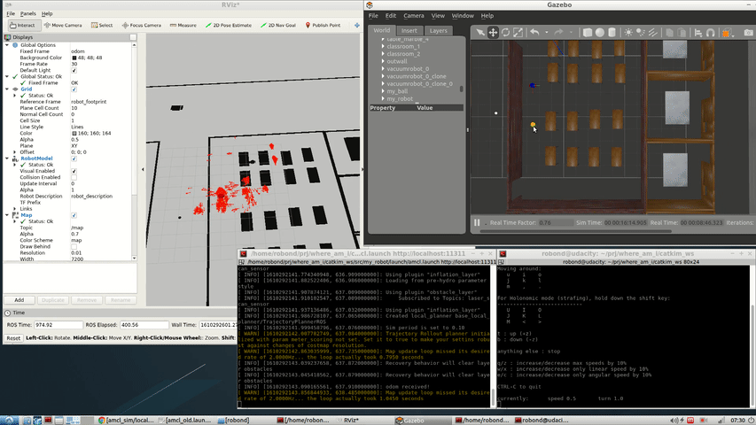
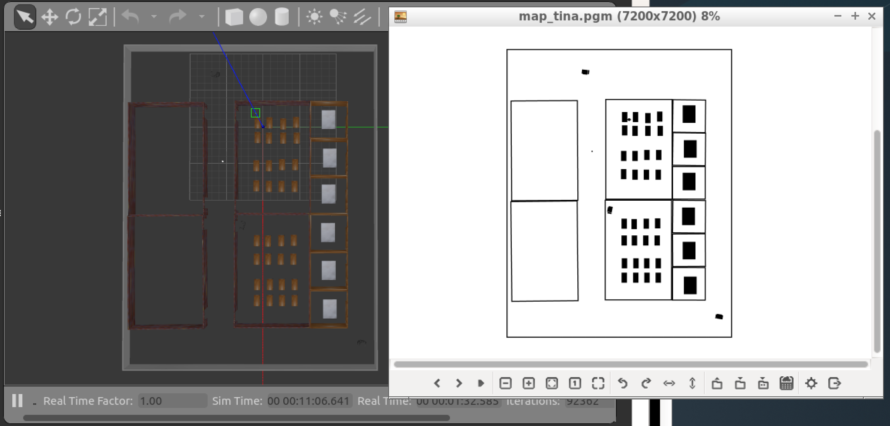
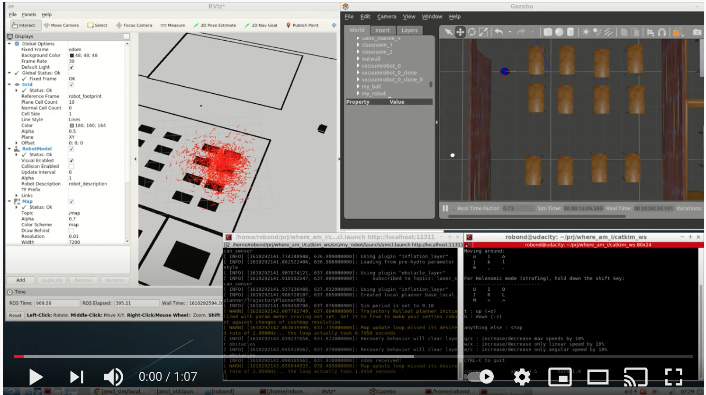

[](https://www.udacity.com/robotics)

# Where am I


Project 3 of the Udacity Robotics Software Engineer Nanodegree. Localization project.In this project, I utilized ROS AMCL package to accurately localize a mobile robot inside a map in the Gazebo simulation environments.


## Description

In project 2, I implemented a robot to chase a white ball. I this project, I modified the code of project 2 for localizing the robot. This project contains:

1. A ROS package that launches a custom robot model in a custom Gazebo world
2. The ROS AMCL package and the Tele-Operation / Navigation Stack to localize the robot
3. Parameters corresponding to each package to achieve the best possible localization results


### Create 2D map of my world

I generated the map from Gazebo world directly using a ROS package:[pgm_map_creator](https://github.com/udacity/pgm_map_creator).

  <p align="center">
    
  </p>


### Prerequisites/Dependencies

* Gazebo >= 7.0  
* ROS Kinetic  
* ROS navigation package  
```
sudo apt-get install ros-kinetic-navigation
```
* ROS map_server package  
```
sudo apt-get install ros-kinetic-map-server
```
* ROS move_base package  
```
sudo apt-get install ros-kinetic-move-base
```
* ROS amcl package  
```
sudo apt-get install ros-kinetic-amcl
```
* make >= 4.1(mac, linux), 3.81(Windows)
  * Linux: make is installed by default on most Linux distros
  * Mac: [install Xcode command line tools to get make](https://developer.apple.com/xcode/features/)
  * Windows: [Click here for installation instructions](http://gnuwin32.sourceforge.net/packages/make.htm)
* gcc/g++ >= 5.4
  * Linux: gcc / g++ is installed by default on most Linux distros
  * Mac: same deal as make - [install Xcode command line tools](https://developer.apple.com/xcode/features/)
  * Windows: recommend using [MinGW](http://www.mingw.org/)
## Setup Instructions (abbreviated)  
1. Meet the `Prerequisites/Dependencies`  
2. Open Ubuntu Bash and clone the project repository  
3. On the command line execute  
```bash
sudo apt-get update && sudo apt-get upgrade -y
```

## Instructions
* Clone this repository
```
git clone https://github.com/tinachientw/RoboND-WhereAmI.git
```
* Open the repository and make  
```
cd $PATH_TO_PARENT_DIR/catkin_ws/
catkin_make
```
* Launch my_robot in Gazebo to load both the world and plugins  
```
roslaunch my_robot world.launch
```  
* Launch amcl node  
```
roslaunch my_robot amcl.launch
```  
* Testing  
You have two options to control your robot while it localize itself here:  
   1. Send navigation goal via RViz  
   2. Send move command via teleop package.  
Navigate your robot, observe its performance and tune your parameters for AMCL.  

**Option 1: Send `2D Navigation Goal`**  

Your first option would be sending a `2D Nav Goal` from RViz. The `move_base` will try to navigate your robot based on the localization. Based on the new observation and the odometry, the robot to further perform the localization.  
Click the `2D Nav Goal` button in the toolbar, then click and drag on the map to send the goal to the robot. It will start moving and localize itself in the process. If you would like to give `amcl` node a nudge, you could give the robot an initial position estimate on the map using `2D Pose Estimate`.  

**Option 2: Use `teleop` Node**  
You could also use teleop node to control your robot and observe it localize itself in the environment.  [Teleop Package](https://github.com/ros-teleop/teleop_twist_keyboard)

Open another terminal and launch the `teleop` script:  
```
cd $PATH_TO_PARENT_DIR/catkin_ws/src
git clone https://github.com/ros-teleop/teleop_twist_keyboard

cd $PATH_TO_PARENT_DIR/catkin_ws/
catkin_make
rosrun teleop_twist_keyboard teleop_twist_keyboard.py
```
You could control your robot by keyboard commands now.  

## Tips  
1. It's recommended to update and upgrade your environment before running the code.  
```bash
sudo apt-get update && sudo apt-get upgrade -y
```


## The Video
Click on the image to watch the video or click [here](https://youtu.be/ZYyIX-z0BC4). You will be redirected to YouTube.[](https://youtu.be/ZYyIX-z0BC4)

## License
Original version of the license of this repository can be found here:
https://gist.github.com/laramartin/7796d730bba8cf689f628d9b011e91d8
